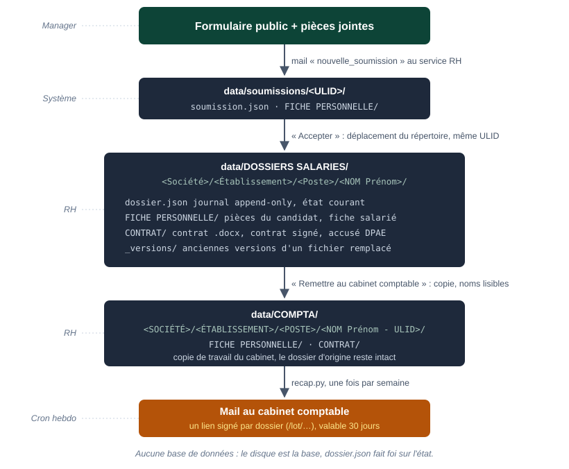

# Documentation technique — Contrat_Gen

> Architecture, fonctionnement interne et guide de maintenance. Ce document décrit le code tel qu'il est ; les captures viennent de l'instance de démonstration (`config.demo/`, client fictif « Basilic Café »).

---

## Sommaire

1. [Architecture générale](#1-architecture-générale)
2. [Principes de conception](#2-principes-de-conception)
3. [Structure du projet](#3-structure-du-projet)
4. [Machine à états et journal](#4-machine-à-états-et-journal)
5. [Stockage : le disque est la base](#5-stockage-le-disque-est-la-base)
6. [Configuration d'une instance](#6-configuration-dune-instance)
7. [Moteur de contrats](#7-moteur-de-contrats)
8. [Mails](#8-mails)
9. [Sécurité](#9-sécurité)
10. [Routes](#10-routes)
11. [Installation et déploiement](#11-installation-et-déploiement)
12. [Exploitation](#12-exploitation)
13. [Tests](#13-tests)
14. [Étendre une instance](#14-étendre-une-instance)

---

## 1. Architecture générale

### Principe fondamental

**Un client = une copie du dépôt.** Le code est le produit ; l'instance (configuration + données) vit à part et n'est jamais versionnée. Aucune donnée n'est mutualisée entre clients.

### Stack

| Couche | Technologie |
|--------|-------------|
| **Runtime** | Python 3.12 |
| **Framework web** | Flask, templates Jinja2 |
| **Serveur WSGI** | Waitress en production (mono-process, 4 threads) ; Werkzeug en développement (`DEBUG=1`) |
| **Contrats** | python-docx (modèles `.docx`), htmldocx (modèles `.html`), num2words (montants en lettres) |
| **Signature électronique** | Yousign, optionnel, désactivé par défaut |
| **Stockage** | Fichiers JSON et arborescence disque. **Aucune base de données.** |
| **Dépendances** | `requirements.txt`, versions épinglées |

### Flux



---

## 2. Principes de conception

### 2.1 Le disque est la source de vérité

`dossier.json` fait foi sur l'état : c'est la dernière entrée `vers` du journal. Un fichier présent sur disque (contrat, accusé) est un indice, jamais une preuve d'état. Le journal ne fait que croître.

### 2.2 Mono-process obligatoire

`store._verrou(uid)` est un verrou de thread : il n'exclut qu'à l'intérieur d'un process. Deux serveurs sur le même stockage perdraient des entrées de journal en silence. Waitress est mono-process par construction ; ne jamais lancer `gunicorn` avec plusieurs workers ni `waitress-serve --processes`. Les plafonds de rate-limit vivent aussi en mémoire du process.

### 2.3 Configuration pure données

Tout ce qui varie d'un client à l'autre vit dans `config/` : JSON, modèles de contrats, modèles de mails. Aucun `.py` n'y entre. L'application ne réécrit jamais sa configuration ; seul `configurer.py compte` ajoute un compte dans `instance.json`.

### 2.4 Garde-fou au démarrage

`config.verifier()` refuse de servir tant que la configuration est incomplète ou dangereuse :

- version de configuration incompatible ;
- secret HMAC encore à sa valeur d'exemple ;
- compte RH au mot de passe d'exemple, aucun compte, ou bloc `utilisateurs` malformé ;
- aucun établissement déclaré ;
- `mails.rh` ou `mails.expediteur` vide, `url` publique vide (les liens du mail hebdomadaire partiraient vides) ;
- rôle du formulaire inconnu ou pointant un champ inexistant, règle `derives` malformée ;
- jeton d'un modèle de contrat sans source ;
- poste sans modèle de contrat, grille de salaire incomplète ;
- bloc `stockage` ou `conservation` malformé, dossier de stockage inexistant ou non inscriptible.

Le même contrôle s'exécute au rechargement à chaud : une configuration invalide est refusée et l'ancienne reste active.

---

## 3. Structure du projet

```text
Contrat_Gen/
├── app.py                  # Routes Flask, parcours, rate-limit, verrou multi-machine
├── store.py                # Stockage disque, ULID, journal, transitions, liens signés, purge
├── contrat.py              # Moteur de remplissage des modèles (.docx / .html -> .docx)
├── config.py               # Lecture de config/, cache, garde-fou verifier()
├── mails.py                # Rendu des modèles .txt, envoi SMTP ou console
├── signature.py            # Signature électronique Yousign (optionnel)
├── installer.py            # Crée l'instance d'un nouveau client
├── configurer.py           # Bilan de la config, assistant, comptes, test SMTP
├── placeholders.py         # Fiche des {{Jetons}} valides, dérivée de la config
├── doctor.py               # Génère un contrat d'essai par croisement de la config
├── recap.py                # Mail hebdomadaire au cabinet comptable (cron)
├── purger.py               # Aperçu de la purge en ligne de commande (lecture seule)
├── demo.py                 # Démo sur config.demo/ et data_demo/
├── templates/              # 9 pages Jinja2 (formulaire, login, suivi, dossier, lot…)
├── config/                 # Instance de démonstration versionnée (fixture des tests)
├── config.exemple/         # Squelette copié par installer.py
├── config.demo/            # Configuration riche pour demo.py (modèles HTML, grille)
├── data/                   # Données de production (jamais versionné)
├── data_demo/              # Données de la démo, effacées à chaque lancement
├── docs/                   # Guides Markdown et PDF (docs/pdf/build.py)
└── tests/                  # Suite de tests, sans framework : python tests/test_x.py
```

### Responsabilités et dépendances internes

| Module | Responsabilité | Importe |
|--------|----------------|---------|
| `app.py` | Routes, contrôle d'accès, rate-limit, effets de bord des transitions (mails, fiche, contrat) | config, store, contrat, mails, signature |
| `store.py` | Répertoires, journal, transitions permises, noms de fichiers lisibles, copie comptable, liens HMAC, purge | config |
| `contrat.py` | Valeurs des jetons, règles dérivées, formats, génération `.docx` | config |
| `config.py` | Chargement JSON, rôles du formulaire, mentions, grille, garde-fou | contrat, store (imports locaux : le cycle est assumé) |
| `mails.py` | Modèles `.txt`, transport SMTP (STARTTLS vérifié) ou console | config, store |

---

## 4. Machine à états et journal


### États

```python
ETATS = ["Soumise", "Rejetee", "ATraiter", "ContratPret",
         "DpaeFaite", "RemisComptable", "Abandonnee", "Parti"]
INACTIFS = {"Rejetee", "Abandonnee", "RemisComptable"}   # grisés dans le suivi
```

### Transitions permises

`store.transition()` est le point de passage unique ; une transition absente de la table lève `ValueError`, même sur un POST forgé.

```python
TRANSITIONS = {
    "Soumise":        {"Abandonnee"},
    "Rejetee":        {"Abandonnee"},
    "ATraiter":       {"ContratPret", "Abandonnee"},
    "ContratPret":    {"DpaeFaite", "Abandonnee"},
    # etat herite : dossiers ecrits avant la suppression de l'etape, jamais atteint
    "ContratSigne":   {"DpaeFaite", "Abandonnee"},
    "DpaeFaite":      {"RemisComptable", "Abandonnee"},
    "RemisComptable": {"Abandonnee"},
}
```

Trois passages ne transitent pas par cette table car ils changent de répertoire ou de zone : `store.valider()` (Soumise → ATraiter, la soumission devient un dossier salarié), `store.rejeter()` (→ Rejetee) et `store.resoumettre()` (Rejetee → Soumise, correction). L'interface n'offre l'abandon qu'à partir de « À traiter ».

### Le journal

Chaque entrée porte au minimum `de`, `vers`, `le` (ISO 8601 UTC) et `par`. Une entrée de transition change `vers` ; une entrée d'événement garde `de == vers` et porte un `type`. Extrait réel d'un dossier de la démo :

```json
{
  "formulaire_version": 1,
  "id": "01M2N3D8WJAFCSD5EG1E15XVNY",
  "champs": {"etablissement": "Basilic Café / Paris Bastille", "poste": "Equipier Polyvalent",
             "nom_prenom": "BENALI Sarah", "date_debut": "2026-10-12", "...": "..."},
  "link_epoch": 0,
  "lien_comptable_epoch": 0,
  "journal": [
    {"de": null, "vers": "Soumise", "le": "2026-09-16T12:35:02+00:00", "par": "formulaire"},
    {"de": "Soumise", "vers": "ATraiter", "le": "2026-09-16T12:35:20+00:00", "par": "rh"},
    {"de": "ATraiter", "vers": "ContratPret", "le": "2026-09-16T12:35:20+00:00", "par": "rh",
     "modele": "Equipier.html"},
    {"de": "ContratPret", "vers": "DpaeFaite", "le": "2026-09-16T12:35:24+00:00", "par": "rh"},
    {"de": "DpaeFaite", "vers": "RemisComptable", "le": "2026-09-16T12:35:25+00:00", "par": "rh"},
    {"de": "RemisComptable", "vers": "RemisComptable", "le": "2026-09-16T12:35:27+00:00", "par": "rh",
     "type": "contrat_signe"},
    {"de": "RemisComptable", "vers": "RemisComptable", "le": "2026-09-16T12:35:29+00:00",
     "type": "acces_lot", "par": null, "ip": "127.0.0.1"}
  ]
}
```

Types d'événements écrits par `store.noter()` : `fiche_salarie`, `fiche_echouee`, `mail_echoue`, `signature_envoyee`, `contrat_signe` (contrat signé déposé, non bloquant, seulement en `RemisComptable`, sans changer d'état ; exclu de la copie `COMPTA/` et du lot par `store.fichiers_compta()`), `renvoi_comptable`, `acces_lot`. S'y ajoute `purge`, posé par `store.purger()` au moment où il allège le journal. Un rejet ajoute `motif` et `commentaire` ; une correction ajoute `motif: "correction"`.


---

## 5. Stockage : le disque est la base

### Arborescence réelle

```text
data/
├── .serveur-actif.json                 # verrou multi-machine
├── soumissions/<ULID>/                 # demandes pas encore acceptées
│   ├── soumission.json
│   └── FICHE PERSONNELLE/              # pièces au nom de leur rôle (identite.pdf, rib.pdf…)
├── DOSSIERS SALARIES/
│   └── <Société>/<Établissement>/<Poste>/<NOM Prénom>/
│       ├── dossier.json                # journal append-only
│       ├── FICHE PERSONNELLE/          # pièces renommées, fiche salarié
│       ├── CONTRAT/                    # contrat .docx, accusé DPAE (jamais le contrat signé)
│       └── _versions/                  # fichiers remplacés, horodatés
├── COMPTA/
│   └── <SOCIÉTÉ>/<ÉTABLISSEMENT>/<POSTE>/<NOM Prénom - ULID>/
│       ├── FICHE PERSONNELLE/
│       └── CONTRAT/
└── mails/                              # mode console : un .eml par envoi
```

Le premier niveau est le `groupe` de l'établissement (à défaut, le nom de la société). L'acceptation **déplace** le répertoire de `soumissions/` vers `DOSSIERS SALARIES/` en gardant l'ULID ; `soumission.json` devient `dossier.json`. Les clés internes des buckets (`pieces`, `contrat`, `_versions`) sont traduites en noms de répertoires lisibles par `store.BUCKETS`. Un fichier déposé par-dessus un existant est archivé dans `_versions/` avant remplacement.

Le mode `stockage.mode = "dossier"` place `data/` dans un répertoire répliqué par un client de synchronisation (OneDrive, SharePoint) ; le garde-fou vérifie alors que le répertoire existe et accepte l'écriture avant de servir. La variable d'environnement `DONNEES`, si elle est posée sur la ligne de lancement, l'emporte sur ce bloc (`config._donnees()`) : une instance lancée avec `DONNEES=` écrit là, pas sur le drive.

### Identifiants

`store.nouvel_id()` produit un ULID : 48 bits de temps en millisecondes puis 80 bits d'aléa, encodés sur 26 caractères en base 32 Crockford (sans I, L, O, U). Triable par date de création, unique sans coordination.

### Verrou multi-machine

`.serveur-actif.json` empêche deux serveurs de servir le même stockage :

```json
{"hote": "poste-rh", "pid": 12345, "le": 1789562000.0}
```

Sur la même machine, le PID est sondé (vivant ou mort). Depuis une autre machine, le verrou est considéré périmé après 5 minutes sans rafraîchissement. Un démarrage refusé affiche l'hôte qui tient le verrou.

---

## 6. Configuration d'une instance

### Fichiers

| Fichier | Contenu |
|---------|---------|
| `instance.json` | Identité du client, secret HMAC, URL publique, mails, comptes, motifs de rejet, modèles par poste, règles dérivées, saisie RH, stockage, conservation |
| `formulaire.json` | Champs du formulaire public et rôles |
| `societes.json` | Sociétés, établissements, mentions légales, couloir de contrat, adresses du manager et du cabinet |
| `grille.json` | Grille de rémunération (optionnel) |
| `contrats/` | Modèles de contrat `.docx` ou `.html` |
| `mails/` | Modèles de mails `.txt` |
| `contrats/fiche_salarie.docx` | Modèle de la fiche salarié du CLIENT (optionnel ; le fichier vit dans `contrats/`, la clé `fiche_salarie` d'`instance.json` le nomme). Sans elle, le modèle générique versé avec le code (`modeles/fiche_salarie.docx`) sert à toutes les instances — la fiche est **toujours** produite à la validation, avec l'un ou l'autre modèle |
| `PLACEHOLDERS.md` | Fiche des jetons valides, générée par `placeholders.py`, à remettre au client |

### `instance.json`

```json
{
  "config_version": 1,
  "client": "Basilic Café",
  "secret": "<64 caractères hexadécimaux, générés par installer.py>",
  "url": "https://embauche.basiliccafe.fr",
  "signature": {"mode": "manuel"},
  "stockage": {"mode": "local"},
  "conservation": {"jours": 1095, "jours_candidature": 730,
                   "apres": ["RemisComptable", "Rejetee", "Abandonnee"]},
  "fiche_salarie": "fiche_salarie.docx",
  "mails": {
    "mode": "smtp", "hote": "smtp.basiliccafe.fr", "port": 587,
    "utilisateur": "rh@basiliccafe.fr", "mot_de_passe": "…", "expediteur": "rh@basiliccafe.fr",
    "rh": ["rh@basiliccafe.fr"], "dpae": null, "recap": null,
    "comptable_defaut": "compta@cabinet.fr"
  },
  "utilisateurs": {"rh": {"mdp_hash": "scrypt:32768:8:1$…"}},
  "motifs_ko": ["Pièce illisible ou manquante", "Informations incohérentes",
                "Établissement ou poste erroné", "Rémunération à revoir", "Autre"],
  "templates": [
    {"quand": {"poste": "Equipier Polyvalent", "temps_partiel": "OUI"},
     "modele": "Equipier_Partiel.html"},
    {"quand": {"poste": "Equipier Polyvalent"}, "modele": "Equipier.html"},
    {"quand": {"poste": "Manager"}, "modele": "Manager.html"}
  ],
  "critiques": ["SalaireChiffres", "SalaireLettres"],
  "saisie_rh": [{"placeholder": "NumeroCarteBTP", "libelle": "N° carte BTP",
                 "aide": "au dos de la carte"}],
  "derives": [
    {"placeholder": "Nationalite", "si": ["nationalite", "==", "Autres"],
     "alors": "{{NationaliteEtrangere}}", "sinon": "française"},
    {"placeholder": "DureeMensuelle", "format": "mensualise", "de": "TempsTravail"}
  ]
}
```

Notes :

- `templates` accepte aussi la forme simple `{"Manager": "Manager.docx"}`. En forme liste, la **première** règle dont tous les `quand` correspondent aux champs du dossier l'emporte : mettre les cas particuliers avant le cas général. Une règle `{"quand": {...}, "modele": null}` marque une **exclusion volontaire** (croisement identifié, mais sans contrat à produire) plutôt que d'omettre la règle ; `doctor` l'affiche « exclu (volontaire) », distinct d'un cas oublié (`✗`). Les deux formes lisent `null` pareil : en forme simple, `{"Manager": null}` exclut le poste de la même façon.
- Le garde-fou de démarrage (`_verifier_regles`) refuse une règle `templates` en liste dont une clé de `quand` n'est pas un champ du formulaire, dont la valeur ne correspond à aucune option du champ visé, ou — pour le champ `etablissement` — qui écrit le nom d'un site seul au lieu de la clé complète « Société / Établissement » (il propose alors la bonne clé). Une règle ou un `quand` qui n'est pas un objet est refusé sans faire planter le garde-fou lui-même.
- `stockage.mode` vaut `local` (répertoire `data/` de l'instance) ou `dossier` avec une clé `chemin` (répertoire synchronisé).
- Le contrat signé ne bloque rien (à recueillir tout de même) : la DPAE se déclare dès `ContratPret`. `store.signe_manquant()` décide à la fois du badge « signé manquant » (« Salariés ») et de l'autorisation du dépôt manuel ou de l'envoi Yousign : état dans `store.SIGNE_DEPOSABLE` (`RemisComptable` seulement : dépôt depuis la fiche salarié), dossier non purgé, aucun signé déjà déposé. L'ancienne clé `signature.avant_dpae` est ignorée ; `doctor` la signale comme obsolète sans changer son verdict. Les dossiers déjà écrits à `ContratSigne` s'affichent sur l'étape « Contrat prêt » et passent à la DPAE.
- `conservation` absent = aucune purge. `jours` et `jours_candidature` sont des entiers strictement positifs ; `apres` liste des états de `store.ETATS`.
- `critiques` : jetons qui doivent avoir une valeur non vide à la génération, en plus des champs requis du formulaire.
- `saisie_rh` : jetons qu'aucun champ ne fournit ; la RH les saisit sur l'écran « À traiter » avant de générer.
- `fiche_salarie` : facultatif. Absent, le modèle générique `modeles/fiche_salarie.docx` (versé avec le code, hors `config/`) sert par défaut : état civil, titre de séjour, coordonnées, poste et contrat, disponibilités, pièces. À la génération, une ligne **de tableau** dont aucun mot-clé n'a de valeur (absent de la config, ou réponse vide) est retirée, et une section vide disparaît avec son titre ; `doctor` liste les lignes que la config n'alimente pas. L'élagage ne concerne que les tableaux : un mot-clé placé dans la prose, un titre ou un en-tête reste obligatoire et fait refuser la fiche s'il n'est pas alimenté. Deux lignes acceptent deux noms de mot-clé : `{{NumSS}}`/`{{NumeroSecu}}` et `{{Domicile}}`/`{{Adresse}}`. Ses **mots-clés** ne sont donc pas vérifiés au démarrage — l'élagage les rend facultatifs — mais sa **présence** l'est : `modeles/fiche_salarie.docx` manquant refuse le démarrage, sinon la fiche échouerait à chaque validation. Un modèle déclaré par le client est vérifié mot-clé par mot-clé, comme un contrat.

### `formulaire.json`

```json
{
  "version": 1,
  "titre": "Formulaire d'embauche",
  "intro": "À remplir par le manager…",
  "champs": [
    {"id": "etablissement", "libelle": "Établissement", "type": "etablissement", "requis": true},
    {"id": "poste", "libelle": "Poste", "type": "choix", "requis": true,
     "options": ["Equipier Polyvalent", "Manager"], "placeholder": "Poste"},
    {"id": "nationalite_etrangere", "libelle": "Nationalité étrangère", "type": "texte",
     "requis_si": ["nationalite", "Autres"], "placeholder": "NationaliteEtrangere"},
    {"id": "cni", "libelle": "Carte Nationale d'Identité (recto-verso)",
     "type": "piece_jointe", "role": "identite", "requis": true, "max_fichiers": 2}
  ],
  "roles": {"nom": "nom_prenom", "email": "email", "date_debut": "date_debut"}
}
```

Types de champs : `etablissement`, `choix`, `texte`, `texte_long`, `date`, `email`, `piece_jointe`. `placeholder` relie un champ à un jeton des modèles. `requis_si: [champ, valeur]` rend un champ obligatoire, et visible, seulement quand un autre champ vaut cette valeur. `version` est recopié dans chaque dossier (`formulaire_version`) pour lire un vieux dossier après un changement de formulaire.

**Tout champ `piece_jointe` doit porter un `role`** — c'est lui, et non l'`id`, qui nomme le fichier sur disque (`identite.pdf`, puis « Identité - NOM Prénom.pdf » une fois le dossier ouvert) et qui permet de reconnaître une pièce déjà déposée. Un champ `piece_jointe` sans `role` n'est pas rattrapé par le garde-fou : il lève un `KeyError` au premier affichage du suivi. `store.LIBELLES_PIECE` donne un libellé humain aux rôles connus (`identite`, `carte-vitale`, `rib`, `contrat`, `contrat-signe`, `accuse-dpae`, `fiche-salarie`) ; un rôle absent de cette table sert de libellé tel quel. `max_fichiers` (défaut 1) autorise plusieurs fichiers pour un même rôle : le premier garde le nom nu, les suivants prennent un suffixe `_2`, `_3`…

Ce `role`-là nomme une **pièce jointe** ; à ne pas confondre avec les **rôles du formulaire** ci-dessous, qui désignent les champs que le moteur sait lire.

### Rôles du formulaire

Le moteur ne lit **aucun identifiant de champ en dur** ; il passe par un vocabulaire fermé de rôles déclarés dans `roles` :

| Rôle | Obligatoire | Usage |
|------|-------------|-------|
| `etablissement` | oui | Mentions légales, cabinet, couloir de contrat, arborescence |
| `poste` | oui | Modèle de contrat, grille de salaire, arborescence |
| `nom` | oui | Nom du répertoire, noms de fichiers, mails |
| `email` | oui | Email du candidat ; repli du lien de correction si l'établissement n'a pas de `manager_email` |
| `prenom`, `nom_usage` | non | Identité quand nom et prénom sont saisis séparément |
| `date_debut` | non | Colonne « Début », alerte de retard, alerte CDD |

Un rôle non déclaré retombe sur son identifiant historique (`etablissement`, `poste`, `nom_naissance`, `email_demandeur`, `date_debut`…) : une configuration sans `roles` garde le comportement d'origine.

### `societes.json`

```json
[
  {
    "nom": "Basilic Café",
    "siren": "789 456 123",
    "comptable_email": "compta@cabinet.fr",
    "mentions": {"RaisonSociale": "BASILIC CAFE SAS", "RCS": "RCS Paris 789 456 123",
                 "SiegeSocial": "…", "ConventionCollective": "…"},
    "etablissements": [
      {"nom": "Paris Bastille", "siret": "789 456 123 00014", "contrat": "genere",
       "manager_email": "bastille@basiliccafe.fr", "groupe": "RESTAURANTS",
       "mentions": {"AdresseEtablissement": "…"}},
      {"nom": "Lyon Confluence", "siret": "789 456 123 00022", "contrat": "depose"}
    ]
  }
]
```

`contrat` vaut `genere` ou `depose` et fixe le couloir. `manager_email` reçoit les liens de correction. `comptable_email` reçoit le récapitulatif hebdomadaire de la société (repli : `mails.comptable_defaut`).

### `grille.json`

Un objet : `champ_heures` à la racine (l'id du champ du formulaire qui porte la durée hebdomadaire), et une liste `postes` où chaque ligne prend l'une des deux formes — forfait mensuel, ou barème par durée :

```json
{
  "champ_heures": "temps_travail",
  "postes": [
    {"poste": "Manager", "mensuel": 2800},
    {"poste": "Equipier",
     "bareme": {"24": {"chiffres": "1 480,08"},
                "35": {"chiffres": "1 801,80"}}}
  ]
}
```

Le poste du dossier est rapproché d'une ligne par mots normalisés, la plus spécifique gagnant : « Equipier Polyvalent » prend la ligne « Equipier », « Assistant Manager » ne prend pas celle de « Manager ». `mensuel` l'emporte sur `bareme` s'ils cohabitent ; le montant du barème (`chiffres`) est servi tel quel, sans recalcul, pour qu'aucun arrondi ne diverge du contrat papier. `{{SalaireLettres}}` n'est **pas** une seconde clé à saisir : le moteur la dérive de `chiffres` (`contrat.lettres_fr`), une seule source pour les deux jetons. Une clé `lettres` encore présente dans un `grille.json` ancien est tolérée et ignorée.

Le garde-fou refuse un barème qui ne couvre pas toutes les options du champ d'heures, et refuse deux postes du formulaire qui retomberaient sur la même ligne (le second sortirait au tarif du premier, sans rien signaler). Il refuse aussi un `chiffres` qui n'est pas un nombre (prose, case vide d'espaces, `1.2.3`) : la lecture tombait alors à zéro sans erreur et le contrat sortait signé avec « zéro » en toutes lettres à côté du bon montant en chiffres. Les écritures acceptées sont `1 480,08`, `1.480,08` et `1480.08`.

---

## 7. Moteur de contrats

### Principe

`contrat.remplir()` est le point d'entrée : il calcule les valeurs de tous les jetons puis remplace chaque `{{Jeton}}` du modèle. Un modèle `.docx` est traité paragraphe par paragraphe avec python-docx (les runs sont préservés) ; un modèle `.html` est rempli en texte puis converti en `.docx` par htmldocx. **Le contrat généré est toujours un `.docx`.**

### Sources des valeurs

| Source | Exemples |
|--------|----------|
| Champs du formulaire (`placeholder` du champ) | `{{NomPrenom}}`, `{{DateDebut}}`, `{{TempsTravail}}` |
| Mentions de la société et de l'établissement | `{{RaisonSociale}}`, `{{Siret}}`, `{{AdresseEtablissement}}` |
| Grille de salaire | `{{SalaireChiffres}}`, `{{SalaireLettres}}` (dérivé de `SalaireChiffres`, jamais saisi à part) |
| Saisie RH (`saisie_rh`) | `{{NumeroCarteBTP}}` |
| Règles dérivées (`derives`) | `{{Nationalite}}`, `{{DureeMensuelle}}`, `{{BlocAutorisationTravail}}` |
| Calculées par le moteur | `{{Aujourdhui}}`, dates en toutes lettres |
| Pièces | `{{PiecesFournies}}`, `{{PiecesManquantes}}` |

### Règles dérivées

Deux formes, évaluées dans l'ordre du fichier (une règle peut utiliser un jeton calculé par une règle précédente) :

```json
{"placeholder": "DureeMensuelle", "format": "mensualise", "de": "TempsTravail"}
```

```json
{"placeholder": "BlocAutorisationTravail",
 "si": ["nationalite", "==", "Autres"],
 "alors": "<p>Titre « {{TypeAutorisation}} » valable jusqu'au {{DateFinValidite}}.</p>",
 "sinon": ""}
```

Formats disponibles : `lettres` (nombre en toutes lettres, centimes compris ; **jamais** « euro(s) » ni « centime(s) » — c'est la prose du modèle qui écrit l'unité, ex. « {{SalaireChiffres}} euros bruts ({{SalaireLettres}}) »), `mensualise` (heures hebdomadaires × 52 / 12), `nombre` (« 24H » → « 24 »), `majuscules`, `date_longue`.

### Vérification

- `config.verifier()` refuse au démarrage tout jeton d'un modèle actif sans source (contrats **et** fiche salarié), ainsi qu'une règle `templates` mal formée ou pointant un champ/une option/une clé d'établissement inconnus (`_verifier_regles`).
- `python doctor.py` génère réellement un contrat pour chaque croisement (poste × temps partiel × établissement × les champs dont dépendent le modèle ou le salaire) **et la fiche salarié**, et signale les cas sans modèle, exclus volontairement (`modele: null`), ou avec une valeur vide.
- `python placeholders.py` écrit `PLACEHOLDERS.md`, la liste exacte des jetons valides pour cette instance, à remettre au client qui balise ses modèles.

---

## 8. Mails

### Modèles

Un fichier `.txt` par mail dans `config/mails/` : la première ligne `Objet: …`, puis le corps. Les `{jetons}` sont ceux passés par le code à `mails.envoyer()`.

| Modèle | Déclencheur | Destinataire |
|--------|-------------|--------------|
| `nouvelle_soumission` | Envoi ou correction du formulaire | `mails.rh` |
| `rejet` | Rejet par la RH | `manager_email` de l'établissement, repli : email du formulaire |
| `rappel_dpae` | Acceptation de la demande | `mails.dpae`, repli : `mails.rh` |
| `recap_hebdo` | `recap.py` (cron) | `comptable_email` de chaque société, copie `mails.recap` ou `mails.rh` |

### Transport

| Mode | Comportement |
|------|--------------|
| `console` | Écrit un `.eml` dans `data/mails/` et l'affiche sur la sortie standard |
| `smtp` | Envoi réel : STARTTLS avec vérification du certificat, puis authentification si `utilisateur` est renseigné |

La variable d'environnement `MAILS_MODE` surclasse `mails.mode`. Un échec d'envoi n'interrompt jamais l'action métier : il est journalisé (`type: mail_echoue`) et signalé à l'écran.

---

## 9. Sécurité

### Authentification et session

Comptes dans `instance.json` → `utilisateurs`, mots de passe hachés par `werkzeug.security` (scrypt). Session Flask signée par le secret de l'instance, cookie `HttpOnly`, `SameSite=Lax`, `Secure` hors `DEBUG`, durée 12 heures.

![[étroit] L'écran de connexion](pdf/img/03-login.png)

### Rate-limit et honeypot

| Point d'entrée | Plafond | Fenêtre glissante |
|----------------|---------|-------------------|
| Formulaire public et correction (`POST /`, `POST /corriger/…`) | 10 envois par adresse IP | 5 minutes |
| Connexion (`POST /login`) | 10 tentatives par adresse IP | 15 minutes |

Le champ caché `website` du formulaire est un honeypot : rempli, la demande est acceptée en apparence mais ignorée. L'adresse IP vient de `X-Forwarded-For` uniquement si `PROXIES` déclare le nombre réel de reverse proxies ; sinon l'en-tête est ignoré.

### Liens signés

Les liens de correction et les liens du cabinet sont signés HMAC-SHA256 avec le secret de l'instance :

```text
<usage>.<ULID>.<horodatage d'émission>.<epoch>.<signature tronquée à 32 hex>
```

`store.verifier_lien()` contrôle la signature, l'usage, l'âge (30 jours) et l'`epoch` du dossier. Incrémenter l'epoch révoque tous les liens émis : `link_epoch` à chaque rejet, `lien_comptable_epoch` au renvoi, à l'abandon et à la purge. Chaque accès à un lot est journalisé avec l'adresse IP.


### Téléversements

Liste blanche d'extensions (`.pdf`, `.jpg`, `.jpeg`, `.png` ; `.docx` en plus pour les contrats), **15 Mo par fichier** (`store.TAILLE_MAX`, vérifié après écriture d'un temporaire) et 40 Mo par requête (`MAX_CONTENT_LENGTH`), noms de fichiers reconstruits par l'application (jamais le nom envoyé). Les fichiers sont servis avec `X-Content-Type-Options: nosniff`.

---

## 10. Routes

### Publiques

| Méthode | Route | Rôle |
|---------|-------|------|
| GET, POST | `/` | Formulaire de demande (POST classique ou `fetch` avec en-tête `X-Requested-With`) |
| GET, POST | `/corriger/<jeton>` | Correction d'une demande rejetée |
| GET | `/lot/<jeton>` | Page du dossier pour le cabinet |
| GET | `/lot/<jeton>/zip` | Archive du dossier |
| GET | `/lot/<jeton>/fichier/<bucket>/<nom>` | Un fichier du dossier |
| GET, POST | `/login` · GET `/logout` | Session RH |

### Espace RH (session requise)


| Méthode | Route | Rôle |
|---------|-------|------|
| GET | `/suivi` | Dossiers en cours (tout sauf RemisComptable), filtres établissement et état |
| GET | `/salaries` | Dossiers remis au comptable, groupés par établissement |
| GET | `/dossier/<uid>` | Fiche d'un dossier |
| GET | `/dossier/<uid>/fichier/<bucket>/<nom>` | Téléchargement d'un fichier |
| POST | `/dossier/<uid>/valider` | Accepter : ouvre le dossier, fiche salarié, rappel DPAE, contrat si couloir généré |
| POST | `/dossier/<uid>/rejeter` | Rejeter : motif, commentaire, mail avec lien de correction |
| POST | `/dossier/<uid>/contrat` | Générer le contrat (saisie RH, ou reprise après échec) |
| POST | `/dossier/<uid>/contrat-depose` | Déposer le contrat (couloir déposé) |
| POST | `/dossier/<uid>/contrat-signe` | Déposer le contrat signé |
| POST | `/dossier/<uid>/signature-envoyer`, `…/signature-verifier` | Signature électronique (si activée) |
| POST | `/dossier/<uid>/dpae-faite` | Enregistrer l'accusé DPAE |
| POST | `/dossier/<uid>/remettre` | Remettre au cabinet : copie dans `COMPTA/` |
| POST | `/dossier/<uid>/renvoyer` | Refaire la copie et révoquer le lien du cabinet |
| POST | `/dossier/<uid>/abandonner` | Abandonner |
| GET, POST | `/purger` | Aperçu puis exécution de la purge |
| POST | `/recharger` | Recharger la configuration |

---

## 11. Installation et déploiement

### Nouveau client

```bash
pip install -r requirements.txt
python installer.py "Basilic Café" /srv/basilic
# stockage dans un dossier synchronisé :
python installer.py "Basilic Café" /srv/basilic "C:/Users/rh/OneDrive - Basilic/Embauches"
```

L'installateur copie `config.exemple/` vers `/srv/basilic/config/`, génère le secret HMAC et un mot de passe RH initial (affiché en fin d'installation, à changer avec `configurer.py compte`), et écrit le bloc `stockage`. Il reste à remplir la configuration :

```bash
CONFIG_DIR=/srv/basilic/config python configurer.py             # bilan : ce qui manque
CONFIG_DIR=/srv/basilic/config python configurer.py --assister  # assistant interactif
CONFIG_DIR=/srv/basilic/config python placeholders.py           # fiche des jetons pour le client
CONFIG_DIR=/srv/basilic/config python doctor.py                 # couverture des modèles
```

### Lancement

```bash
CONFIG_DIR=/srv/basilic/config DONNEES=/srv/basilic/data python app.py   # production (waitress)
DEBUG=1 python app.py                                                     # développement (werkzeug)
```

| Variable | Défaut | Rôle |
|----------|--------|------|
| `CONFIG_DIR` | `config/` | Répertoire de configuration de l'instance |
| `DONNEES` | `data/` à côté de `config/` | Répertoire de données ; **l'emporte sur** `stockage.chemin`, y compris en mode `dossier` |
| `HOST`, `PORT` | `127.0.0.1`, `5000` | Adresse et port d'écoute |
| `PROXIES` | `0` | Nombre de reverse proxies devant l'application ; active la lecture de `X-Forwarded-For` |
| `DEBUG` | absent | Serveur de développement, cookie sans `Secure` |
| `MAILS_MODE` | absent | Surclasse `mails.mode` (`console` ou `smtp`) |

### Reverse proxy

L'application écoute en local ; un reverse proxy porte le TLS et transmet l'IP d'origine.

```text
# Caddy
embauche.basiliccafe.fr {
    reverse_proxy localhost:5000
}
```

Lancer alors avec `PROXIES=1`. Waitress efface par défaut les en-têtes `X-Forwarded-*` non déclarés : `PROXIES` est lu par `app.py` pour configurer waitress **et** Flask, un réglage seul ne suffit pas.

### Tâche hebdomadaire

```bash
CONFIG_DIR=/srv/basilic/config DONNEES=/srv/basilic/data python recap.py
```

À planifier une fois par semaine (cron, tâche planifiée Windows). Sans cette tâche, les dossiers remis n'arrivent jamais au cabinet.

### Sauvegarde et mise à jour

```bash
tar czf sauvegarde-$(date +%F).tar.gz /srv/basilic/config /srv/basilic/data
```

Restaurer = décompresser et relancer. Mettre à jour = remplacer le code (`git pull`) et relancer : `config/` et `data/` ne sont jamais modifiés par le code, il n'y a rien à migrer.

---

## 12. Exploitation

| Besoin | Commande ou écran |
|--------|-------------------|
| Vérifier la configuration | `python configurer.py` (bilan), garde-fou au démarrage |
| Tester l'envoi de mail | `python configurer.py mail votre@adresse` |
| Ajouter un compte RH | `python configurer.py compte identifiant` |
| Vérifier les modèles de contrat | `python doctor.py` |
| Recharger la configuration sans redémarrer | Bouton « Recharger la configuration » du suivi (`POST /recharger`) |
| Voir ce que la purge effacerait | `python purger.py` (lecture seule) ; `/purger` dans l'application pour exécuter |
| Suivre ce que fait le serveur | Sortie standard : les deux lignes de démarrage et les erreurs Python. **Waitress ne journalise pas les requêtes** — l'historique métier est le journal de chaque dossier |
| Mails en mode console | `data/mails/*.eml` |


Le démarrage refuse de servir si un autre serveur tient le verrou du stockage, si la configuration est invalide, ou si le dossier de stockage synchronisé n'est pas accessible en écriture. Le message d'erreur nomme la cause.

---

## 13. Tests

Aucun framework : chaque fichier est un script exécutable, la suite est verte quand tous sortent avec le code 0.

```bash
python tests/test_parcours.py         # les deux couloirs de bout en bout, fiche, récap
python tests/test_ecrans.py           # rendu de chaque écran dans chaque état
python tests/test_formulaire.py       # soumission fetch (JS) du formulaire public
python tests/test_pieces_multi.py     # pièces multi-fichiers (recto/verso)
python tests/test_valeurs_contrat.py  # valeurs imprimées dans le contrat (grille, mensualisation)
python tests/test_produit.py          # garde-fou, fiche salarié, version de configuration
python tests/test_clients.py          # deux instances isolées, étanchéité multi-client
python tests/test_login.py            # rate-limit, session, PROXIES à travers waitress
python tests/test_mails.py            # mode console, surcharge, STARTTLS vérifié
python tests/test_configurer.py       # bilan, assistant, comptes, test SMTP
python tests/test_doctor.py           # couverture de configuration
python tests/test_purge.py            # éligibilité, effacement, journal conservé
python tests/test_signature.py        # Yousign contre un transport factice
```

Les tests utilisent `config/` (fixture versionnée, client fictif) ou construisent une configuration temporaire. `test_clients.py` vérifie que tout nouveau module racine est bien couvert : y ajouter tout nouveau `.py` à la racine.

---

## 14. Étendre une instance

### Ajouter un champ au formulaire

1. Ajouter l'entrée dans `formulaire.json` → `champs` (identifiant, libellé, type, `requis` ou `requis_si`).
2. S'il alimente un jeton : `"placeholder": "MonJeton"`, puis `{{MonJeton}}` dans les modèles.
3. S'il joue un rôle pour le moteur (nom, email, date de début) : le déclarer dans `roles`.
4. `python placeholders.py` puis `python doctor.py`, et « Recharger la configuration ».

### Ajouter un modèle de contrat

1. Déposer le `.docx` ou `.html` dans `config/contrats/`.
2. L'associer dans `instance.json` → `templates`, en forme liste si le choix dépend d'autres champs :
   ```json
   {"quand": {"poste": "Equipier Polyvalent", "type_contrat": "CDD"}, "modele": "Equipier_CDD.html"}
   ```
3. `python doctor.py` pour vérifier que chaque croisement a un modèle et aucune valeur vide.

### Ajouter un établissement, une société, un compte

- Établissement : `societes.json` → `etablissements` (nom, SIRET, `contrat`, `manager_email`), puis « Recharger la configuration ».
- Société : nouvel objet dans `societes.json` avec ses mentions et son `comptable_email`.
- Compte : `python configurer.py compte identifiant`.

### Ajouter un mail

1. Créer `config/mails/<nom>.txt` : première ligne `Objet: …`, puis le corps avec des `{jetons}`.
2. Appeler `mails.envoyer("<nom>", destinataires, **valeurs)` depuis le code.

### Personnaliser les motifs de rejet

`instance.json` → `motifs_ko` : la liste s'affiche telle quelle dans le menu du rejet.

---

*Contrat_Gen — édition du 16 septembre 2026*
