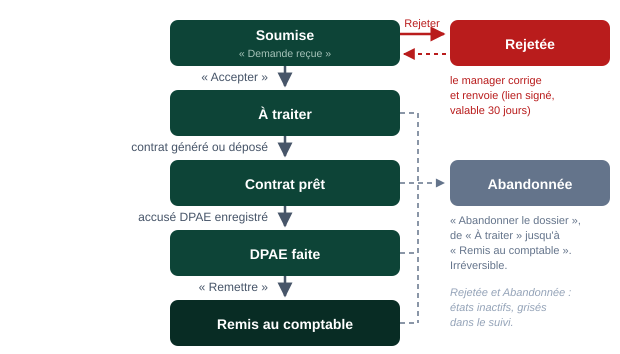

# Guide utilisateur — Parcours embauche

> **Contrat_Gen** automatise l'embauche, de la demande du manager à la remise du dossier au cabinet comptable. Ce guide décrit chaque écran dans l'ordre du parcours. Les captures viennent de l'instance de démonstration (client fictif « Basilic Café »).

---

## Sommaire

1. [Vue d'ensemble du parcours](#1-vue-densemble-du-parcours)
2. [Le formulaire de demande (manager)](#2-le-formulaire-de-demande-manager)
3. [Le suivi RH](#3-le-suivi-rh)
4. [Accepter la demande](#4-accepter-la-demande)
5. [Le contrat](#5-le-contrat)
6. [Le contrat signé](#6-le-contrat-signé)
7. [La déclaration DPAE](#7-la-déclaration-dpae)
8. [La remise au cabinet comptable](#8-la-remise-au-cabinet-comptable)
9. [Rejeter une demande et la faire corriger](#9-rejeter-une-demande-et-la-faire-corriger)
10. [Abandonner un dossier](#10-abandonner-un-dossier)
11. [Les salariés](#11-les-salariés)
12. [La purge des anciens dossiers](#12-la-purge-des-anciens-dossiers)
13. [Recharger la configuration](#13-recharger-la-configuration)
14. [Questions fréquentes](#14-questions-fréquentes)

---

## 1. Vue d'ensemble du parcours

Chaque demande d'embauche est un **dossier** qui avance d'étape en étape. Une étape franchie ne se refait pas : on ne revient en arrière que par le rejet (avant acceptation) ou l'abandon.



**Qui fait quoi :**

| Acteur | Rôle |
|--------|------|
| **Manager** | Remplit le formulaire public et joint les pièces du candidat. Reçoit le lien de correction en cas de rejet. |
| **Service RH** | Accepte ou rejette la demande, suit le dossier, dépose le contrat signé et l'accusé DPAE, remet le dossier au cabinet. |
| **Système** | Envoie les mails, génère la fiche salarié et le contrat, copie le dossier pour le cabinet. |
| **Cabinet comptable** | Reçoit chaque semaine un mail avec un lien par dossier remis, sans compte à créer. |

**Deux façons de produire le contrat**, fixées par établissement dans la configuration :

| Couloir | Ce qui se passe | Ce que voit la RH |
|---------|-----------------|-------------------|
| **Contrat généré** | Le contrat est produit par l'application depuis le modèle du poste, avec les informations du formulaire et les mentions légales de la société. | Rien à faire : le contrat est généré au moment de l'acceptation. Un bouton **« Générer le contrat »** n'apparaît que si la configuration demande une saisie RH complémentaire, ou si la génération automatique a échoué. |
| **Contrat déposé** | Le contrat est rédigé hors application (outil de paie, modèle Word maison). | Un bouton **« Déposer le contrat »** pour téléverser le fichier (PDF ou .docx). |

---

## 2. Le formulaire de demande (manager)

### Accès

L'adresse dépend de l'installation (en démonstration : `http://localhost:5000`). Aucun compte n'est nécessaire : le formulaire est public.

### Remplir la fiche

Les champs sont définis par la configuration du client ; ils peuvent donc différer de la capture ci-dessous. Les champs marqués d'un astérisque sont obligatoires. Certains n'apparaissent que selon une réponse précédente (par exemple le titre de séjour quand la nationalité n'est pas française).


1. **Établissement** : il détermine la société employeur, les mentions légales du contrat, le cabinet comptable et le couloir (contrat généré ou déposé).
2. **Identité et coordonnées du candidat** : NOM Prénom tel qu'il figurera sur le contrat, date de naissance, téléphone, email et adresse du candidat.
3. **Le poste et le contrat** : dates d'embauche et de début, type de contrat, temps de travail, horaires. Le salaire est calculé par la grille du client quand elle existe.
4. **Pièces jointes** : chaque fichier choisi apparaît sous forme de vignette avec une croix pour le retirer. Tant que la demande n'est pas envoyée, rien ne part.
5. **Envoyer la demande**.

### Les pièces jointes

La liste des pièces est fixée par la configuration. Exemple de la démonstration :

| Pièce | Remarque |
|-------|----------|
| Attestation de carte vitale | Un fichier |
| RIB | Un fichier |
| Carte nationale d'identité | Recto et verso : deux fichiers, à choisir en une ou deux fois |
| Justificatif de domicile | Un fichier |

**Contraintes :** formats `.pdf`, `.jpg`, `.jpeg`, `.png` ; **15 Mo maximum par fichier**, et 40 Mo pour l'envoi entier (toutes pièces comprises). Un scan trop lourd est refusé avec le message « fichier trop lourd » : rescannez en qualité moindre plutôt qu'en couleur pleine résolution.

### Envoyer

Cliquez sur **« Envoyer la demande »**. Si une information manque ou qu'un fichier est refusé, l'erreur s'affiche en haut de page et les pièces déjà choisies sont conservées : corrigez et renvoyez.

![[étroit] La confirmation affichée après l'envoi](pdf/img/02-confirmation.png)

Le service RH reçoit aussitôt un mail « nouvelle demande » avec le lien vers le dossier. Le manager, lui, n'est recontacté qu'en cas de rejet (voir §9).

---

## 3. Le suivi RH

### Connexion

Rendez-vous sur `/login` avec l'identifiant et le mot de passe remis à l'installation (en démonstration : `rh` / `demo-rh`). La session dure 12 heures.

![[étroit] L'écran de connexion](pdf/img/03-login.png)

> **Attention :** après 10 tentatives ratées en 15 minutes, la connexion est bloquée temporairement depuis votre adresse.

### Le tableau de bord « Demandes d'embauche »


1. **Filtres** par établissement et par état.
2. **La liste des dossiers en cours**, triée par date de début. Un dossier remis au comptable n'y figure plus : il passe dans l'onglet « Salariés ».
3. **« Recharger la configuration »** : à utiliser après une modification des fichiers de configuration (voir §13).

Colonnes du tableau :

| Colonne | Contenu |
|---------|---------|
| **Salarié** | Nom du candidat ; cliquer dessus ouvre le dossier. |
| **Établissement**, **Poste** | Tels que saisis dans le formulaire. |
| **Début** | Date de début de contrat. En **rouge** avec la mention « en retard » si elle est dépassée alors que le dossier n'est pas terminé. |
| **État** | Étape en cours (Soumise, À traiter, Contrat prêt, DPAE faite, Rejetée, Abandonnée). |
| **Dernière activité** | Depuis quand le dossier n'a pas bougé. En rouge au-delà de 7 jours. |
| **Pièces manquantes** | Nombre de pièces attendues et absentes, ou « — ». |

Sous le titre, le compteur **« en attente d'action »** additionne les dossiers Soumise et À traiter. Les dossiers rejetés ou abandonnés restent visibles, grisés. Quand une règle de conservation est configurée, un bandeau signale les dossiers dont les pièces peuvent être purgées et un bouton **« Purger les dossiers terminés »** apparaît (voir §12).

### La fiche d'un dossier


1. **La frise des étapes** : l'étape en cours est marquée « étape en cours », les étapes franchies sont cochées.
2. **La carte d'action** : elle ne propose que ce qui est possible à l'étape en cours. Ici, accepter ou rejeter.
3. **Informations saisies** dans le formulaire.
4. **Pièces du candidat** (cliquables) et **documents produits** par l'application ou déposés par la RH.
5. **Le journal** : chaque changement d'état, qui l'a fait et quand. Il est conservé pour toujours, même après purge.

---

## 4. Accepter la demande

Sur un dossier à l'état **« Soumise »**, la carte « Décision » propose **« Accepter — ouvrir le dossier »**. Le bouton est grisé tant qu'une pièce obligatoire manque : il faut alors rejeter la demande pour que le manager complète (voir §9).


**Ce que fait l'acceptation, en une seule fois :**

1. Le dossier passe à **« À traiter »** et rejoint l'arborescence des dossiers salariés (société / établissement / poste / NOM Prénom). Les pièces reçoivent un nom lisible (« Carte vitale - NOM Prénom.pdf »).
2. La **fiche salarié** est générée (pièce « Fiche salarié » dans les documents produits) : au modèle du client s'il en a un, sinon à un modèle générique fourni avec l'application.
3. Un **mail de rappel DPAE** part au service RH (ou à l'adresse dédiée si elle est configurée), avec ce qu'il faut pour déclarer : nom, poste, date de début, employeur et SIRET.
4. En couloir **contrat généré** sans saisie RH, le **contrat est produit immédiatement** et le dossier passe directement à **« Contrat prêt »**.


Exemple de mail de rappel DPAE :

```text
Objet : DPAE à déclarer — DUPONT Jean

Bonjour,

Une embauche vient d'être validée : la DPAE est à déclarer.

  Salarié      : DUPONT Jean
  Poste        : Equipier Polyvalent
  Début        : 28/09/2026
  Employeur    : Basilic Café — Paris Bastille
  SIRET        : 789 456 123 00014

Les pièces du salarié sont dans le dossier : https://…/dossier/01M2N3D81N4G…
Une fois la DPAE faite, déposez-y l'accusé.
```

> **Attention :** si le message après acceptation indique « rappel DPAE NON parti » ou « contrat NON généré », le dossier est bien ouvert mais l'action a échoué. La raison est dans le journal du dossier (mail refusé, modèle de contrat manquant, valeur obligatoire vide).

---

## 5. Le contrat

### Couloir « contrat généré »

Le contrat est produit depuis le modèle associé au poste (fichier `.docx` ou `.html` de la configuration) : les jetons `{{Nom}}`, `{{DateDebut}}`, `{{SalaireChiffres}}`… sont remplacés par les données du formulaire, la grille de salaire et les mentions légales de la société. Le résultat est toujours un fichier **Word (.docx)**, nommé « Contrat - NOM Prénom.docx ».

Deux cas où la RH intervient à l'état **« À traiter »** :

- **La configuration demande une saisie RH** (par exemple un numéro de carte professionnelle) : la carte « Contrat » affiche les champs à remplir puis le bouton **« Générer le contrat »**.
- **La génération a échoué à l'acceptation** : le même bouton permet de relancer après correction de la configuration.

### Couloir « contrat déposé »

Pour un établissement configuré en contrat déposé, la carte « Contrat » propose de téléverser le fichier rédigé hors application (PDF ou .docx).


### Après génération ou dépôt

Le dossier est à l'état **« Contrat prêt »**. Le contrat apparaît dans **« Documents produits »**, d'où il se télécharge.

![[étroit] Les documents produits après génération du contrat](pdf/img/10-documents-produits.png)

---

## 6. Le contrat signé

Le contrat signé ne bloque ni la DPAE, ni la remise au cabinet, mais il doit être recueilli. Il se dépose **uniquement depuis la fiche du salarié** (vue « Salariés »), une fois le dossier remis au cabinet : tant qu'il manque, le bloc « Contrat signé » s'affiche en haut de la fiche.


1. Téléchargez le contrat depuis « Documents produits ».
2. Faites-le signer hors application (impression et signature, ou votre outil de signature habituel).
3. Ouvrez la fiche du salarié dans « Salariés », choisissez le fichier signé (PDF ou .docx) et cliquez sur **« Déposer le contrat signé »**.

Le dossier ne change pas d'état : le bloc quitte le haut de la fiche et « Déposé le … » s'affiche sous « Lien comptable ». Le dépôt se fait une seule fois. Tant qu'il manque, le badge **« signé manquant »** le rappelle dans « Salariés ». Il reste au dossier RH : il n'est **pas transmis au cabinet comptable**, ni dans la copie, ni dans le lien de téléchargement. Il n'est plus possible de le déposer une fois le salarié parti.

> **Note :** une signature électronique intégrée (Yousign) existe en option. Si elle est activée dans la configuration, le bloc propose en plus **« Envoyer à la signature »** puis **« Vérifier la signature »**, au même endroit que le dépôt manuel ; le contrat signé est alors récupéré automatiquement.

---

## 7. La déclaration DPAE

La DPAE (déclaration préalable à l'embauche) se fait sur le site de l'URSSAF, hors application, avec les informations du mail de rappel reçu à l'acceptation.


1. Faites la déclaration et récupérez l'accusé de réception.
2. Choisissez le fichier de l'accusé (PDF, JPG ou PNG) et cliquez sur **« Enregistrer l'accusé DPAE »**.

Le dossier passe à **« DPAE faite »**. L'accusé rejoint les documents produits et partira avec le dossier au cabinet.

---

## 8. La remise au cabinet comptable

### Remettre le dossier

À l'état **« DPAE faite »**, la carte « Transmission » propose **« Remettre au cabinet comptable »**.


**Ce qui se passe :**

1. Le dossier passe à **« Remis au comptable »** : la frise est complète et le dossier quitte le suivi pour l'onglet « Salariés ».
2. Une **copie** du dossier est faite dans le répertoire `COMPTA/`, en capitales et avec des noms de fichiers lisibles. Le dossier d'origine reste intact.
   ```text
   COMPTA/BASILIC CAFE/PARIS BASTILLE/EQUIPIER POLYVALENT/BENALI SARAH - 01M2N3D8…/
       CONTRAT/
           Contrat - BENALI SARAH - 2026-09-16.docx
           Accusé DPAE - BENALI SARAH - 2026-09-16.pdf
       FICHE PERSONNELLE/
           Carte vitale - BENALI SARAH - 2026-09-16.pdf
           Identité - BENALI SARAH - 2026-09-16.pdf
           Identité_2 - BENALI SARAH - 2026-09-16.pdf
           RIB - BENALI SARAH - 2026-09-16.pdf
           justif domicile - BENALI SARAH - 2026-09-16.pdf
   ```
3. Le dossier est inscrit au prochain **mail hebdomadaire** du cabinet.

### Refaire la copie et le lien

Sur un dossier remis, la carte « Lien comptable » propose **« Refaire la copie et le lien »** : utile si une pièce a été remplacée après la remise. L'ancien lien est révoqué et le dossier repart dans le prochain mail hebdomadaire.


### Le mail hebdomadaire au cabinet

Une fois par semaine (tâche planifiée à l'installation), chaque cabinet reçoit la liste des dossiers remis depuis 7 jours, avec un **lien personnel par dossier**, valable **30 jours**. Le service RH est en copie. La commande peut aussi être lancée à la main :

```bash
python recap.py              # dossiers remis ces 7 derniers jours
python recap.py --jours 14   # sur 14 jours
```

### La page du lot, côté cabinet

Le lien ouvre la page du dossier sans aucune connexion : informations du salarié, fichiers téléchargeables un à un ou **« Tout télécharger (.zip) »**.


> **Attention :** posséder le lien suffit pour accéder au dossier. Ne le transférez pas hors du cabinet. Chaque ouverture est inscrite au journal du dossier avec l'adresse IP.

---

## 9. Rejeter une demande et la faire corriger

### Rejeter

Sur un dossier **« Soumise »**, la seconde partie de la carte « Décision » permet de renvoyer la demande au manager.


1. Choisissez un **motif** dans la liste (configurable : pièce illisible ou manquante, informations incohérentes, établissement ou poste erroné, rémunération à revoir, autre).
2. Écrivez un **commentaire** qui dit précisément quoi corriger : c'est ce que lira le manager.
3. Cliquez sur **« Rejeter »**.


**Effets :** le dossier passe à **« Rejetée »** et un mail part à l'adresse du manager de l'établissement, celle déclarée dans la configuration (`manager_email`). Si l'établissement n'en déclare aucune, le mail part à l'adresse email saisie dans le formulaire, c'est-à-dire celle du candidat : déclarez donc l'adresse de chaque manager à l'installation.

```text
Objet : Demande d'embauche à corriger — MARTIN Léa

Bonjour,

La demande d'embauche de MARTIN Léa a été rejetée par le service RH.

Motif : Pièce illisible ou manquante
Commentaire : La carte vitale est illisible, merci de la rescanner.

Corrigez-la ici (lien valable 30 jours) : https://…/corriger/correction.01M2N3DN….
```

### Corriger

Le lien ouvre le formulaire **pré-rempli**, avec le motif et le commentaire en tête de page. Le manager corrige les champs ou remplace les pièces, puis renvoie.


**Effets :** la demande revient à **« Soumise »** avec une entrée « correction » au journal, le service RH est prévenu par mail, et le lien de correction ne fonctionne plus (il a servi). Un nouveau rejet génère un nouveau lien ; l'ancien est révoqué.

---

## 10. Abandonner un dossier

À partir de l'état « À traiter » et jusqu'à « Remis au comptable », le bas de la fiche propose **« Abandonner le dossier »** (désistement du candidat, embauche annulée). Le dossier passe à **« Abandonnée »** : plus aucune action n'est possible, le journal et les pièces sont conservés jusqu'à la purge. Une demande encore à l'état « Soumise » se rejette, elle ne s'abandonne pas.

> **Attention :** l'abandon est irréversible. Sur un dossier déjà remis, le lien du cabinet est révoqué.

---

## 11. Les salariés

L'onglet **« Salariés »** (`/salaries`) liste les dossiers arrivés au bout du parcours, groupés par établissement.


| Colonne | Contenu |
|---------|---------|
| **Salarié** | Cliquer ouvre la fiche du dossier. |
| **Poste**, **Contrat** | Poste et type de contrat (CDI, CDD). |
| **Début**, **Ancienneté** | Date de début et temps écoulé depuis. |
| **Cabinet** | Adresse du cabinet comptable de la société. |
| **Remis le** | Date de la remise au cabinet. |

---

## 12. La purge des anciens dossiers

Si une règle de conservation est configurée (bloc `conservation` de la configuration), les pièces des dossiers terminés peuvent être effacées au bout d'un délai, conformément au RGPD.

### Dossiers concernés

Un dossier est proposé à la purge quand il est dans l'un des états listés dans la règle (typiquement Remis au comptable, Rejetée, Abandonnée) depuis plus longtemps que la durée configurée. Une durée distincte s'applique aux demandes jamais acceptées.

### Procédure

1. Depuis le suivi, cliquez sur **« Purger les dossiers terminés »** (ou le lien du bandeau).
2. La page liste les dossiers concernés avec leur ancienneté par rapport à la durée de conservation.
3. Cliquez sur **« Purger ces N dossier(s) »**.


**Ce qui est effacé :** toutes les pièces (identité, RIB, contrats, accusé, fiche salarié) et la copie comptable. Les liens du cabinet et de correction sont révoqués.

**Ce qui est conservé :** le journal réduit à ses changements d'état (date, étape, auteur), avec une entrée « purge » — les commentaires libres, les motifs de rejet et les adresses IP en sont retirés ; et, des informations du dossier, l'établissement, le poste et la date de début.

**Le nom du salarié est effacé, lui aussi :** c'est une donnée personnelle. Le dossier ne s'identifie plus que par son identifiant, et son répertoire est renommé `purge-<identifiant>`. La fiche reste consultable et indique la date de purge ; elle ne permet plus de savoir de qui il s'agissait.

> **Astuce :** `python purger.py` affiche la même liste en ligne de commande sans rien effacer.

---

## 13. Recharger la configuration

Après une modification des fichiers de configuration (nouvel établissement, salaire revalorisé, motif de rejet ajouté), cliquez sur **« Recharger la configuration »** dans le suivi. Aucun redémarrage n'est nécessaire.

Une configuration invalide n'est pas prise en compte : l'ancienne reste active et le message indique ce qui bloque.

---

## 14. Questions fréquentes

### Je ne vois pas de bouton « Générer le contrat »

C'est normal : en couloir généré, le contrat est produit dès l'acceptation. Le bouton n'existe que si la configuration demande une saisie RH ou si la génération a échoué (le message après acceptation le dit, et le journal donne la raison).

### Le bouton « Accepter » est grisé

Une pièce obligatoire manque : la liste « Pièces du candidat » l'indique en rouge. Rejetez la demande avec le motif « Pièce illisible ou manquante » pour que le manager complète.

### Le lien de correction ne fonctionne plus

Le lien expire après 30 jours, ne sert qu'une fois, et un nouveau rejet en génère un nouveau. Si la demande a été corrigée entre-temps, elle est de nouveau « Soumise » et n'attend plus de correction.

### Le manager n'a pas reçu le mail de rejet

Le message affiché après le rejet le signale (« le mail n'est pas parti ») et le journal du dossier porte une entrée « mail_echoue ». Vérifiez la configuration des mails avec `python configurer.py mail votre@adresse`.

### Je ne reçois aucun mail

- En mode `console` (démonstration), les mails ne sont pas envoyés mais écrits dans `data/mails/`.
- En mode `smtp`, testez l'envoi : `python configurer.py mail votre@adresse`.

### Le contrat ne se génère pas

- Le poste doit avoir un modèle dans la configuration (`templates`).
- Chaque jeton du modèle doit avoir une source : `python doctor.py` génère un contrat d'essai pour chaque poste et signale les valeurs vides.

### Comment ajouter un établissement ou un compte RH ?

- Établissement : l'ajouter dans `societes.json`, puis « Recharger la configuration ».
- Compte : `python configurer.py compte identifiant` (le mot de passe est demandé à l'écran).

---

*Contrat_Gen — édition du 16 septembre 2026*
